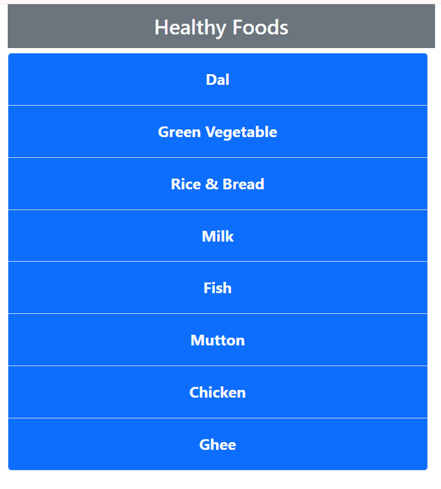

# Learning fragment , Props passing ,  Click Event, Children Passing Props, onClick , onChange 

I want to complete this code with full stack web development...
In this recent file i use Bootstrap , React 

## Installation

Install my-project with npm and run your local computer

```bash
  git clone "paste here the repo link"
  cd 2-Bangladesh-clock-version-one 
  node -v 
  npm v 
  npm install
  npm start  
```


## Authors

- [@AvinandanRoy](https://www.github.com/AvinandanRoy)

## Screenshots-1


## Screenshots-2




